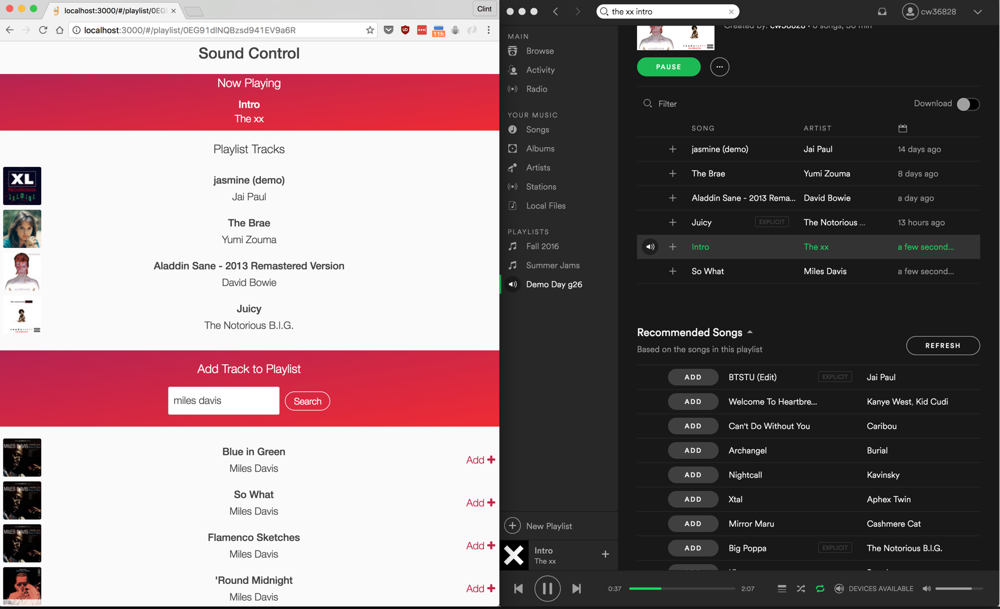

# Sound Control
Web application that allows people to collaborate on the currently playing playlist together using just their phone’s web browser. Everyone is able to see the currently playing track as well as the queue of songs in the playlist. Everyone is also able to search for and add songs to the playlist.

Built using:
* HTML
* CSS
* JavaScript
* Angular
* Node
* Express
* Spotify API
* Last.fm API
* OAuth2
